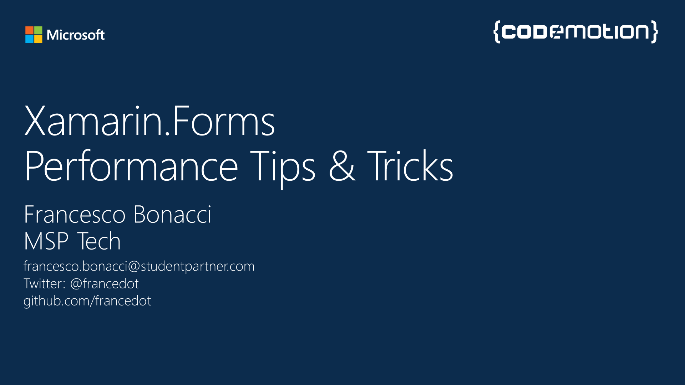

# Xamarin.Forms Performance Tips & Tricks

_This repo is a submodule for my Xamarin.Forms fork [codemotion-demo](https://github.com/francedot/Xamarin.Forms/tree/codemotion-demo)._

## List of codemotion-demo sub-branches:
2. [binding](https://github.com/francedot/Xamarin.Forms/tree/binding) : Demo about Binding Performance 

####Author: Francesco Bonacci, MSP Tech
####Twitter: @francedot | Email: francesco.bonacci@studentpartner.com

